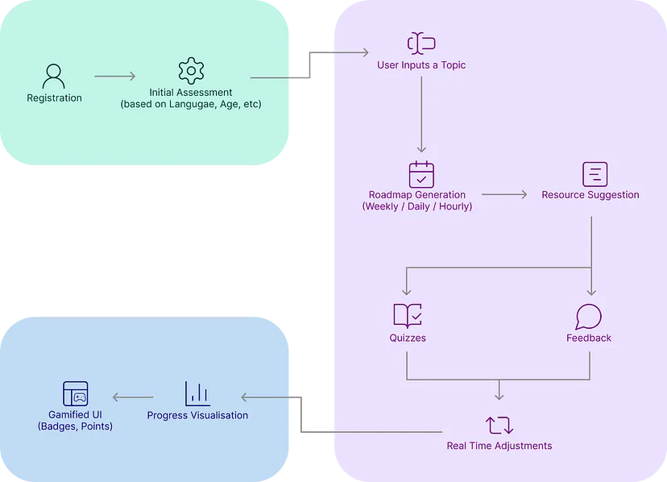
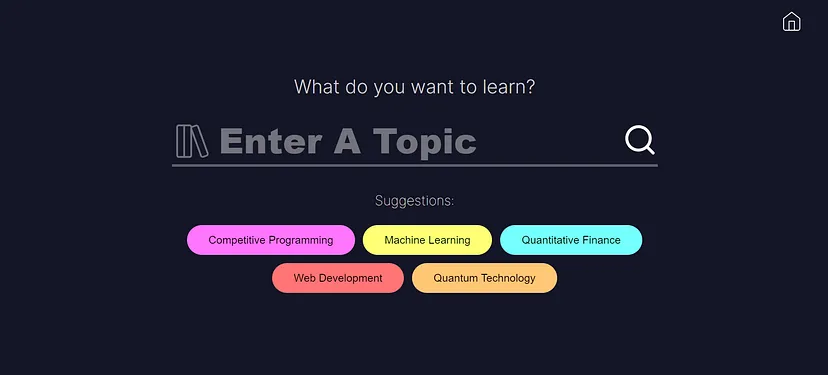

# 🧑‍💻 Learn Anything Easily With Personalized Learning Paths Using AI


Imagine a platform that gives you a detailed personalized roadmap along with resources for any topic that you want to learn, based on your individual needs, time constraints, preferable language, and current knowledge level. This is exactly what our AI-driven web based educational platform delivers.

## Installation

# AI-Powered Personalized Learning Platform

**Team Name:** Neural Nomads  
**Team Number:** 10  
**Course:** ITCS-6112 SSDI Project Deliverable  
**Document:** User Manual

---

## 🚀 Deployment / Installation Steps

### 🔧 Prerequisites

Ensure the following are installed:
- Node.js and npm
- Python (preferably 3.8+)
- pip
- MongoDB (for persistent data storage)
- An OpenAI Gemini API Key (for AI-based recommendations)

---

### 🧪 Installation Steps

1. **Clone the Repository**
```bash
git clone https://github.com/HemantKumar01/AIPersonalizedLearningPlatform.git
cd AIPersonalizedLearningPlatform
```
```bash
npm install
```
```bash
cd backend

# For Windows
.\humanaize\Scripts\activate

# For Linux/Mac
source humanaize/bin/activate

pip install -r requirements.txt
```
```bash
GEMINI_API_KEY=YOUR_GEMINI_API_KEY
```
```bash
npm run backend
```
```bash
npm start
```
## What Exactly will this Platform do?
We are creating a web based platform, where users can get personalized roadmaps along with resources to learn something new. The platform will also track and visualize progress of the user.

The Users will provide a topic which they want to learn. Along with the topic they can also provide the time they have to learn it, preferable language, and the knowledge level they have.

Generative AI will be incorporated to create roadmaps, schedules and quizzes along with expected time to complete topics. Along with it resources will be recommended using a smart data and API based system. Depending on quizzes and feedback the roadmap will be dynamically personalized. The progress will be tracked and visualized in the platform.

## How will it Work?
The flow of the solution can be understood by the following simplified user flow diagram






